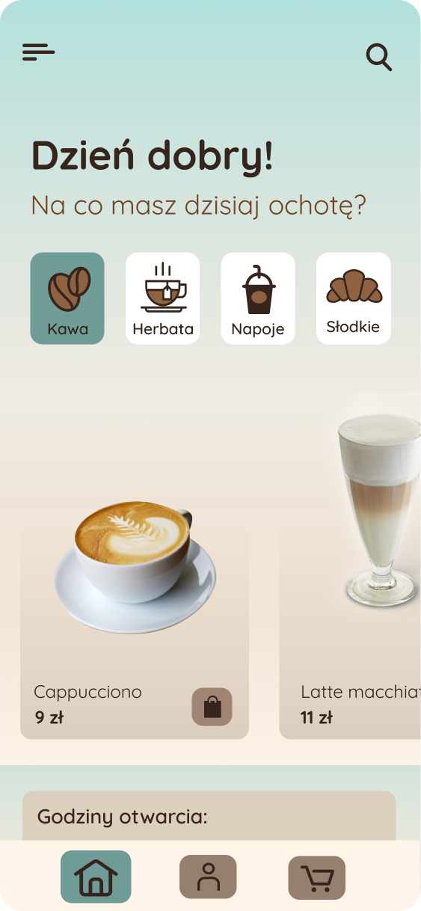

# Project: Coffee - coffee ordering app.

Simple app for ordering coffee from favourite cafe created with flutter.

## Table of Contents:

1. [About project](#about-project)
2. [Bulit with](#built-with)
3. [Status](#status)

## About project:

Coffee ordering app with pickup / take-away for a specific cafe.
  

**Functionality:**
- user profile, registration
- product categories
- product detail view
- adding to the cart, previewing the cart
- information about the cafe (map, opening hours)
- payment handling

## Built with:

- Framework - Flutter
- Language - Dart
- Database - Firebase Firestore
- Payment - Stripe
- UI design - Figma

## Status:

In progress.